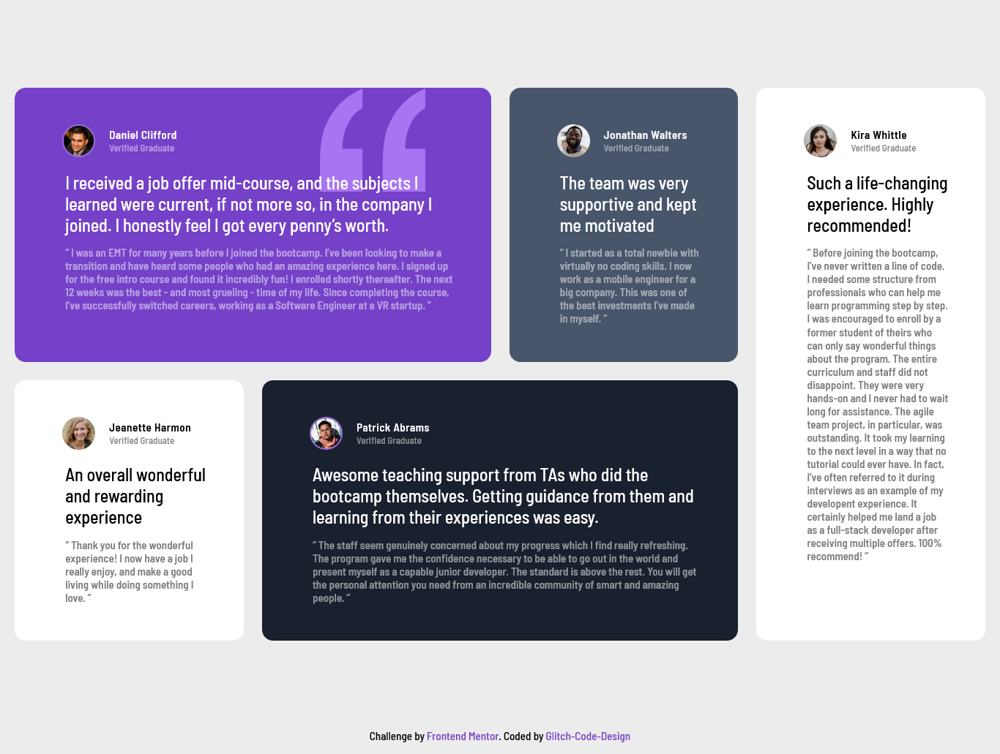

# Frontend Mentor - Testimonials grid section solution

This is a solution to the [Testimonials grid section challenge on Frontend Mentor](https://www.frontendmentor.io/challenges/testimonials-grid-section-Nnw6J7Un7). Frontend Mentor challenges help you improve your coding skills by building realistic projects. 

## Table of contents

- [Overview](#overview)
  - [The challenge](#the-challenge)
  - [Screenshot](#screenshot)
  - [Links](#links)
- [My process](#my-process)
  - [Built with](#built-with)
  - [What I learned](#what-i-learned)

## Overview

### The challenge

Users should be able to:

- View the optimal layout for the site depending on their device's screen size

### Screenshot

### Links

- Solution URL: [Front-End Mentor](https://www.frontendmentor.io/profile/Glitch-Code-Design)
- Live Site URL: [Github Pages](https://glitch-code-design.github.io/Front-End-Mentor-Testimonial-Grid-Challenge/)

## My process

### Built with

- Visual Studio Code

### What I learned

I am still very much new to web design, and i am trying to teach myself everything there is to know about it, so this challenge seemed like a great way to practice and learn some things about CSS Grid.